<p align="center">
  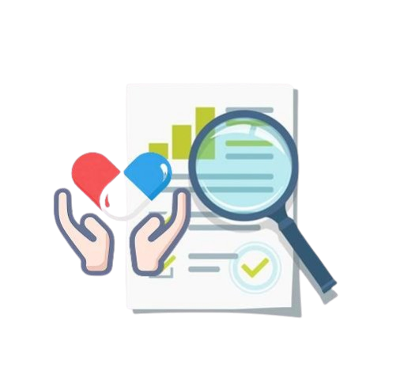
</p>

# VabGenRx
## AI-Powered Clinical Drug Safety & Decision Support

> **AI Dev Days Hackathon 2025** · Microsoft Foundry · Microsoft Agent Framework · Azure MCP · GitHub Copilot

[](https://yellow-sea-05177870f.2.azurestaticapps.net/login)
[](LICENSE)

---

## Demo Video

▶️ [Watch the Demo on YouTube](https://www.youtube.com/watch?v=PLACEHOLDER)

---

## What is VabGenRx?

Think about the last time a doctor had ten minutes to see a patient, review their full history, check eight medications, account for two chronic conditions, confirm pharmacy stock and still make a safe prescribing decision. That is not a hypothetical. That is Tuesday morning in every clinic, every hospital and every outpatient practice in the world.

VabGenRx was built for that moment.

It is a production-ready, evidence-based, AI-powered clinical medication safety platform that works in the background of a clinician's workflow doing in seconds what would otherwise take hours of cross-referencing across databases, literature, lab reports and pharmacy systems. When a prescription is written, VabGenRx gets to work immediately.

It checks for drug interactions, food conflicts, disease contraindications and dosing risks based on the patient's actual lab values. It verifies real-time pharmacy stock. It generates patient counselling in the patient's own language. And it does all of this through a six-phase multi-agent AI pipeline built on Microsoft Agent Framework, hosted on Microsoft Foundry returning a complete, evidence-grounded clinical safety report in under 90 seconds.

Not a list of warnings. A clinical narrative that tells the prescriber exactly what the risks are, how serious they are and what to do next grounded strictly in PubMed literature and FDA databases. Never in guesswork.

---

## Project Summary

**VabGenRx** is a production-ready, multi-agent clinical pharmacology platform that solves one of healthcare's most dangerous and overlooked problems: the impossibility of safely managing polypharmacy at the point of care.

**Who is it for?** Built for prescribers, clinical pharmacists, and hospital pharmacy teams who need real-time, evidence-grounded medication safety intelligence at the moment a prescribing decision is made.

**What does it do?** It runs a complete six-phase AI pipeline — evidence gathering from PubMed and FDA, drug-drug interaction analysis, drug-disease contraindication checking, precision dosing based on patient labs, patient counselling in 100+ languages, and a final cross-domain orchestration layer that detects compounding risks no single check would catch. All grounded strictly in published evidence. Never in hallucination.

**How is it built?** Five specialist Azure AI Agents (Safety, Disease, Dosing, Counselling, Orchestrator) run on Microsoft Foundry using Microsoft Agent Framework. Evidence is sourced live from PubMed NCBI and FDA OpenFDA APIs. Results are cached in Azure SQL. All prescriber-facing output is scanned through Azure AI Content Safety. The platform is deployed on Azure App Service and Azure Static Web Apps, with HIPAA-compliant audit logging and 9 Application Insights monitoring alerts. The A2A protocol endpoint at `/.well-known/agent.json` allows external agents to discover and invoke VabGenRx skills programmatically via Azure MCP.

---

## The Problem It Solves

Every year, the World Health Organization estimates that medication-related harm costs the global healthcare system $42 billion. Not from carelessness. Not from bad doctors. From the sheer, overwhelming complexity of modern prescribing that no human being can fully process alone, in real time, at the point of care.

The reality of modern medicine is that patients are sicker, older and on more medications than ever before. Polypharmacy defined as five or more concurrent medications is no longer the exception. It is the everyday reality for elderly patients, patients managing chronic diseases and anyone who has passed through the hands of more than one specialist.

A patient on eight medications does not just have eight drugs to think about. They have 28 possible drug-drug interaction pairs, 40 drug-disease combinations and 8 individual dosing checks that all need to be evaluated at the same time, against each other, in the context of that specific patient's lab values, organ function and comorbidities. And there are over 125,000 possible drug-drug interaction pairs among the 500 most commonly prescribed drugs alone.

No prescriber however experienced, however diligent can do that in ten minutes. The information exists. It is buried across thousands of FDA label PDFs, pharmacovigilance databases, PubMed studies and clinical guidelines that no human can realistically search at the moment a decision must be made.

The consequences of missing even one signal are severe: hospitalisation, organ failure, life-threatening bleeding events and death from drug combinations that were individually safe but catastrophic together.

What makes this even harder is that patients today routinely see multiple specialists who prescribe independently, with no single clinician seeing the complete medication picture. A cardiologist adds a drug. A nephrologist adds another. A GP renews a third. Nobody has the full picture. Nobody flags the compound risk that only emerges when all three are seen together.

The problem is not ignorance. It is the impossibility of processing that information fast enough, comprehensively enough, at the exact moment a prescribing decision is being made.

### Why Current Tools Fall Short

Existing drug interaction checkers were built for a simpler era of medicine. They flag too many low-severity warnings creating alert fatigue that causes clinicians to dismiss even the serious ones. And at the same time, they miss the complex, compounding risks that only emerge when you look across drug-drug, drug-disease and dosing findings together.

They do not reason. They pattern match. They do not explain why a risk exists or what to do about it. And they almost never integrate with clinical context like lab values, patient age or organ function.

Here is a real clinical scenario VabGenRx was designed for: a patient whose eGFR is low, whose potassium is elevated, who is simultaneously on an ACE inhibitor, an NSAID and a potassium-sparing diuretic. A basic checker flags each drug independently. VabGenRx detects that all three findings converge on the same renal pathway, triggers a second round of specialist analysis with that compounding context injected and returns a unified clinical narrative telling the prescriber precisely what is happening, why it is dangerous and what to do. All grounded in evidence. Never in assumption.

### Four Capabilities, One Clinical Workflow

- **Drug, Disease & Food Interaction Checker**

Modern prescribing does not happen in isolation. A drug interacts not just with other drugs, but with the patient's diagnosed conditions, their diet and their entire clinical history. VabGenRx checks every prescription in real time across all three dimensions simultaneously flagging interactions before the prescription is even written.

Every interaction is classified by clinical severity Major, Moderate or Minor so clinicians know instantly which findings demand immediate action and which simply need monitoring. All data is pulled directly from the National Library of Medicine and the FDA via live API calls. This is real-world, live clinical evidence the same gold standard sources that clinical pharmacologists use, delivered in real time at the point of care.

- **Precision Dosing — Tailored to the Individual Patient**

The textbook dose is written for an average patient. Your patient is never average.

VabGenRx calculates the right dose for the specific individual factoring in their renal function, liver impairment, lab values, age, weight and intersubject variability drawn from live FDA label data. A patient with stage 3 chronic kidney disease does not need the same dose of metformin as a healthy 35-year-old. VabGenRx knows the difference, calculates accordingly and presents the clinician with a dose that is right for this patient, right now.

- **Out-of-Stock Checker — Connected to Live Hospital Inventory**

Writing the right prescription only matters if the medication is actually available. Before a prescription is printed, VabGenRx queries the hospital's live pharmacy inventory database directly. If a medication is unavailable, it instantly surfaces formulary compliant alternatives with real-time pricing so the clinician can make an informed switch in one click, before the patient leaves the room.

U.S. hospitals spent 20 million hours and nearly $900 million in labour costs managing drug shortages in 2023 alone. And 88% of physicians only found out a drug was unavailable after the patient had already left through a call from the pharmacist or the patient themselves returning empty-handed. VabGenRx closes that loop before it opens.

- **Patient Counselling — Translated into Any Language**

A prescription without understanding is an incomplete prescription. Inadequate counselling accounts for 55% of medication non-adherence and when a patient cannot understand their discharge instructions because they are in a language they do not speak, the clinical encounter has already begun to fail.

VabGenRx generates personalised disease and drug counselling for every patient explaining their condition in plain terms, detailing how to take their medication, what foods or activities to avoid and what warning signs to watch for. It then translates that counselling into 100+ languages, powered by Azure OpenAI (GPT-4o). Not a generic machine translation a clinically accurate, patient-safe communication that preserves drug names, dose values and lab abbreviations exactly as written. Because a patient who genuinely understands their treatment is a patient who follows it, recovers and does not come back through the emergency door.

---

## Hero Technologies

| Technology | How It's Used |
|---|---|
| **Microsoft Agent Framework** | Five specialist AI agents (Safety, Disease, Dosing, Counselling, Orchestrator) built on `azure-ai-agents`, running with `temperature=0` for deterministic clinical outputs |
| **Microsoft Foundry** | Agent hosting, AI-Assisted evaluation (100% pass rate on 15/15 test cases), OpenTelemetry tracing, Application Insights monitoring |
| **Azure MCP** | A2A (Agent-to-Agent) protocol endpoint at `/.well-known/agent.json` — external agents can discover and invoke VabGenRx skills programmatically |
| **GitHub Copilot** | Used in VS Code for README authoring, test code generation, and code suggestions throughout development |

---

## Architecture Diagrams

### 1. System Architecture

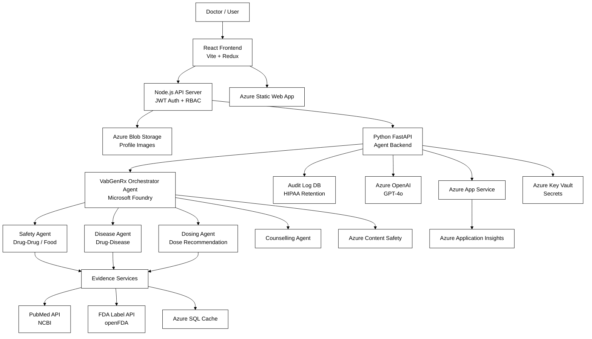

### 2. Backend Agent Architecture

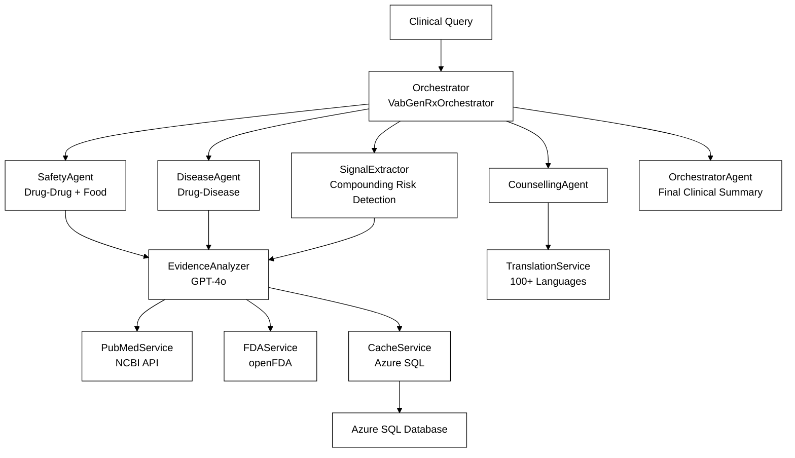

### 3. Evidence Retrieval Pipeline

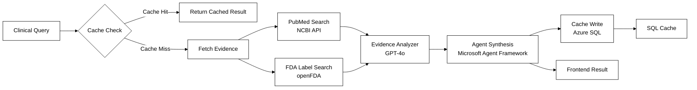

### 4. Azure Deployment Architecture

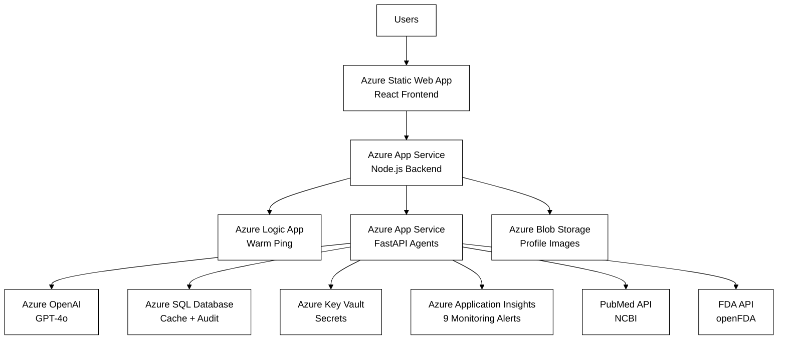

---

## Screenshots

### Login Page
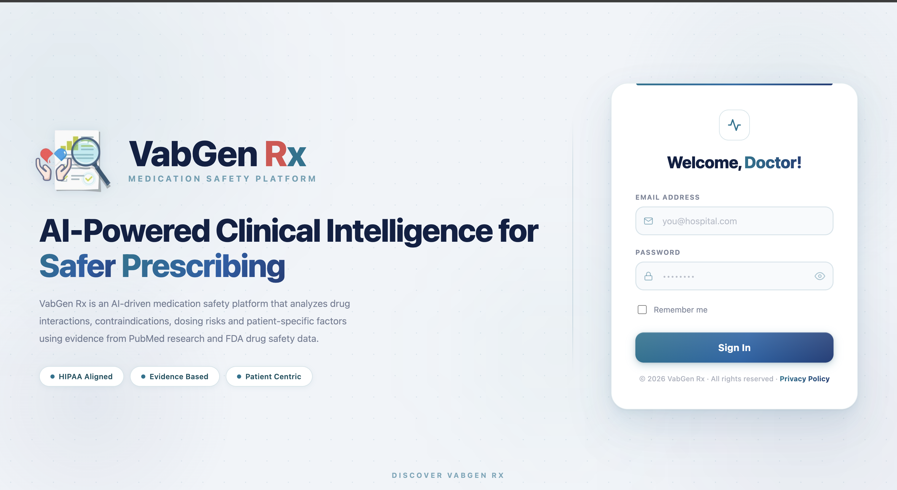

### Doctor Dashboard
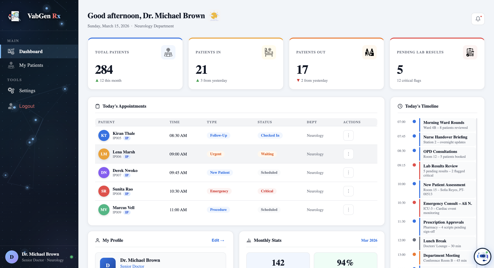

### My Patients — Patient List
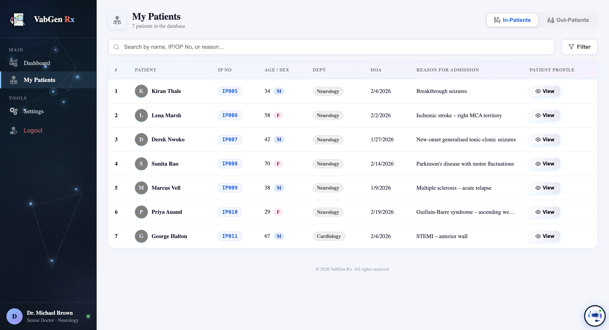

### Patient Profile — Demographics
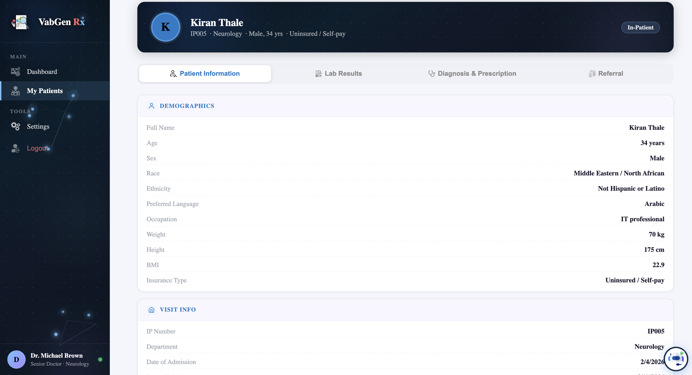

### Patient Profile — Lab Results
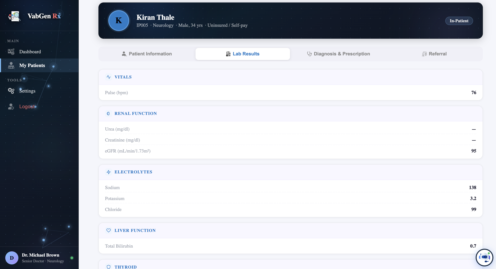

### Diagnosis & Prescription
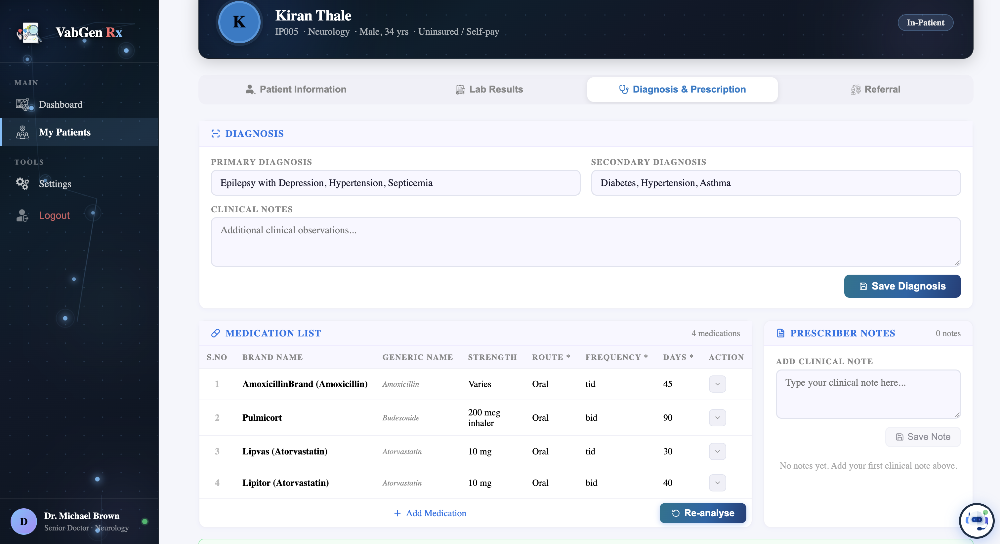

### Out-of-Stock Medication Finder
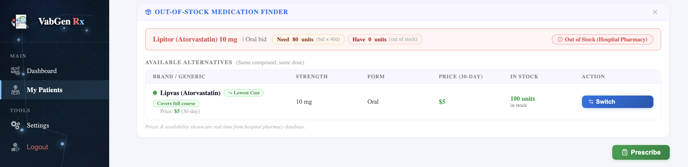

### Drug Interaction Warning — Drug-Drug & Dosing Recommendations
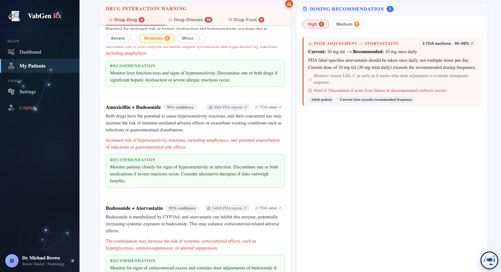

### Drug Interaction Warning — Drug-Disease
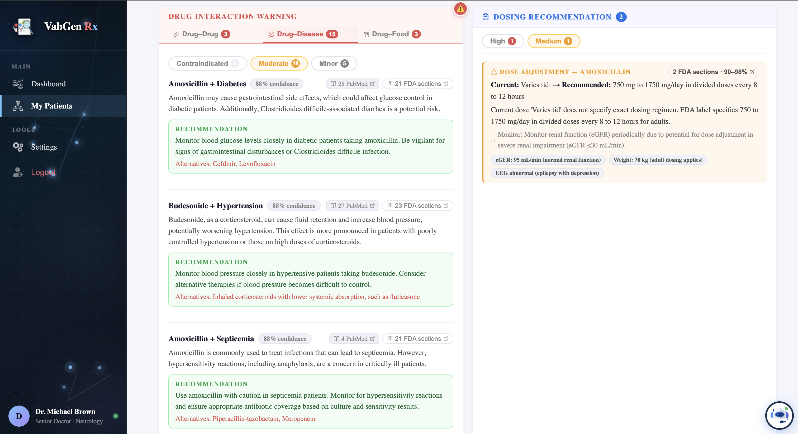

### Drug Interaction Warning — Drug-Food
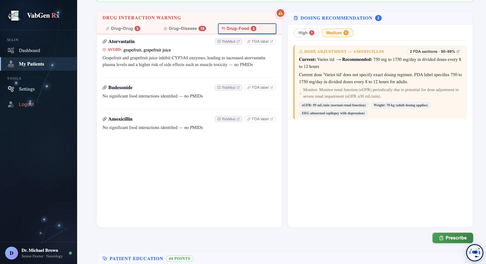

### E-Prescription
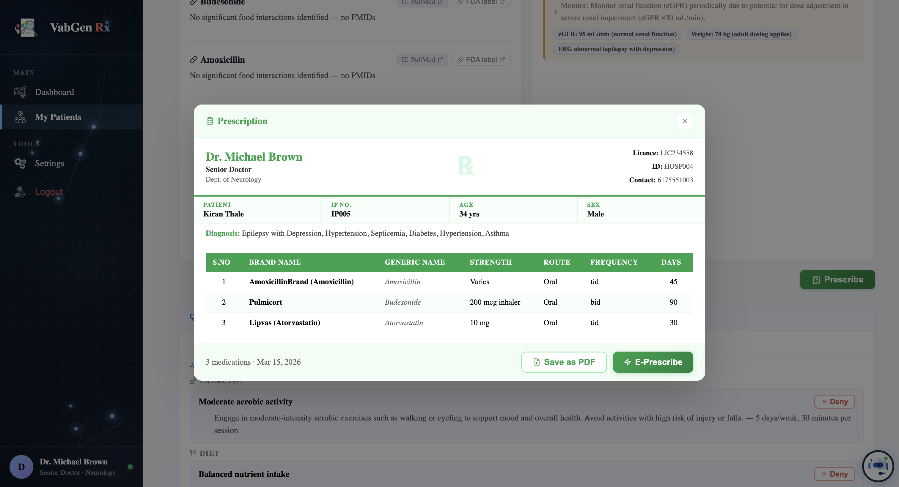

### Patient Education — Drug Counselling
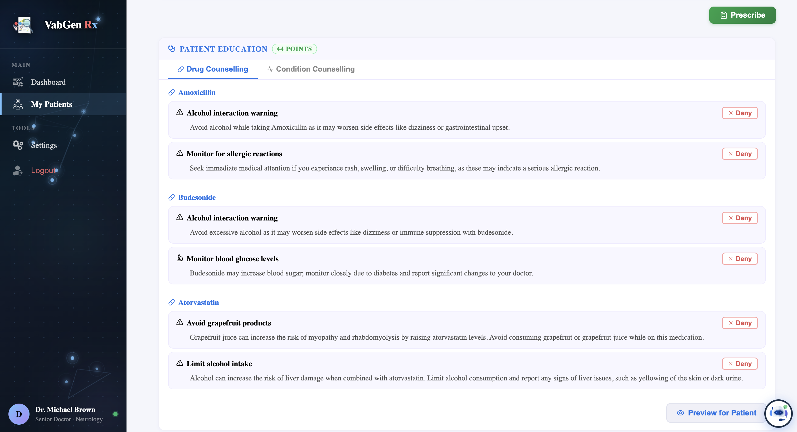

### Patient Education — Condition Counselling
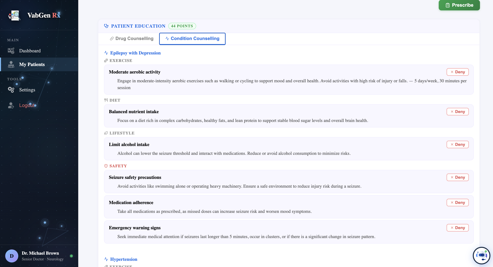

### Multilingual Counselling Preview (Spanish)
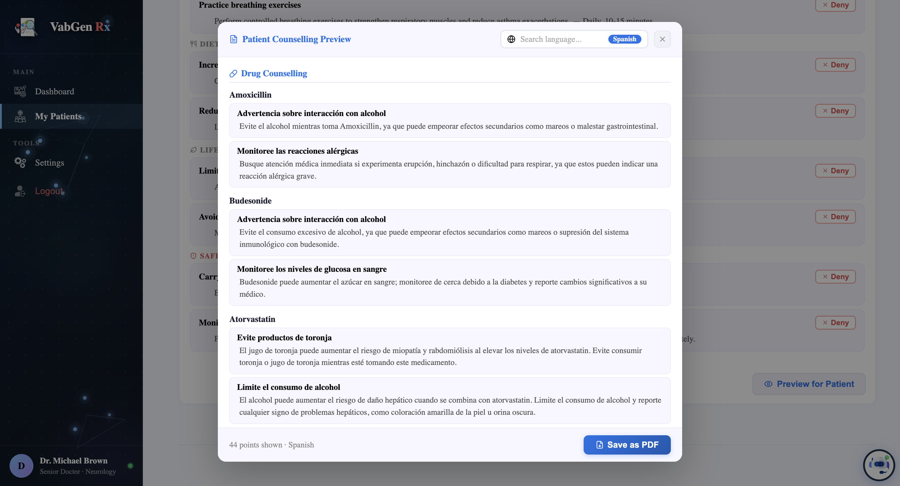

### Patient Counselling PDF Export
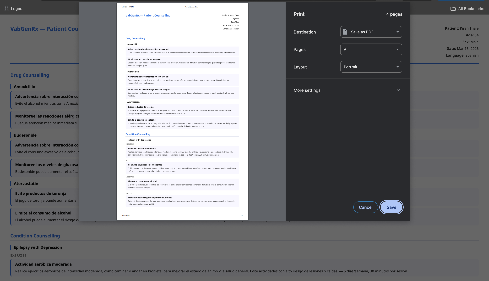

---

## Frontend Features

- **Secure Authentication (JWT)**
  Role-based login using JSON Web Tokens. Tokens are attached to all secure API requests, enabling stateless, secure communication between client and server.

- **Password Security (bcrypt)**
  All passwords are hashed with bcrypt before storage. Passwords are never stored in plain text even a database breach cannot expose credentials directly.

- **90-Day Password Expiration**
  Doctors are required to update their password every 90 days, reducing long-term credential exposure risks.

- **15-Minute Session Timeout**
  Inactive sessions automatically expire after 15 minutes to prevent unauthorized access on unattended devices.

- **Role-Based Access Control (RBAC)**
  Doctors are categorized by specialty (Cardiology, Neurology, Oncology, Pediatrics, etc.) and can only access patients assigned to their role ensuring data separation and patient privacy.

- **Account Recovery & Change Notifications**
  Secure email-based password recovery. After any password change, an automated notification email is sent as an additional security safeguard.

- **Integrated Chatbot Assistant**
  An in-platform chatbot helps doctors navigate clinical workflows more efficiently.

- **Dark Mode / Light Mode**
  Full theme support for reduced eye strain and customizable readability.

- **Redux State Management**
  Centralized, predictable application state with secure handling of sensitive user data in the client environment.

---

## Backend: Six-Phase AI Pipeline

### Phase 1 — Parallel Evidence Gathering
- `SafetyEvidenceService` and `DiseaseEvidenceService` run concurrently
- Azure SQL cache is checked first (parallel) before any external API call
- PubMed and FDA OpenFDA are queried only for cache misses
- Semaphores cap concurrent PubMed requests at **20** and FDA at **3**
- Combination drugs (e.g. `rosiglitazone/Metformin`) are split into components for accurate FAERS lookup

### Phase 2 — Round 1 Specialist Synthesis (Parallel)
Three Azure AI Agents run simultaneously on Microsoft Foundry:

- **VabGenRxSafetyAgent** — Synthesizes drug-drug interactions in batches of ≤5 pairs
  - 3-layer resilience: cache bypass, retry on truncation, fill-from-cache/placeholder
- **VabGenRxDiseaseAgent** — Synthesizes drug-disease contraindications in batches of ≤8
  - Injects full core FDA sections (up to 600 chars each) directly into agent prompts
- **VabGenRxDosingAgent** — Evaluates patient labs (eGFR, potassium, TSH, bilirubin) against FDA thresholds
  - Runs via `DosingService` directly in parallel with no Azure Agent overhead

> After synthesis, evidence patch methods (`patch_drug_drug_evidence`, `patch_drug_disease_evidence`) stamp correct evidence counts from raw evidence, bypassing any agent misreporting.

### Phase 3 — Signal Extraction
- A single GPT-4o call reviews all Round 1 findings
- Detects **compounding organ-system risk patterns** where findings from drug-drug, drug-disease and dosing domains converge on the same physiological pathway
- Returns structured signals with `round2_instructions` per organ system
- Degrades gracefully to empty dict on failure so the pipeline never blocks

### Phase 4 — Conditional Round 2 Re-evaluation
- Executes **only** when Phase 3 detects compounding signals
- `DiseaseAgent` and `DosingAgent` re-run in parallel with compounding context injected
- Compounding signals are passed via `patient_data["other_investigations"]` with service code unchanged
- Sets `round2_updated=true` only when recommendations actually change from Round 1

### Phase 5 — Patient Counselling
- Drug and condition counseling generated in parallel
- Compounding context and confirmed interactions injected as a summary string
- Strictly evidence-based and never assumes unconfirmed patient habits
- Supports **100+ languages** via `TranslationService` (Azure OpenAI GPT-4o)
- Results cached per `drug|sex|age_group|habits` composite key (30-day TTL)

### Phase 6 — Orchestrator Synthesis
- `VabGenRxOrchestratorAgent` performs cross-domain reasoning across all specialist outputs
- Produces compounding risk patterns, prioritized clinical actions and a narrative clinical summary
- All output text scanned through **Azure AI Content Safety** (single combined API call)
- `trace_session_id` (UUID, never PHI) attached for OpenTelemetry correlation in Microsoft Foundry
- Falls back to basic count-based summary if agent fails so the pipeline always returns a valid response

---

## Multi-Agent System

| Agent | Role | Phase |
|---|---|---|
| `VabGenRxSafetyAgent` | Drug-drug + drug-food synthesis | Phase 2 Round 1 |
| `VabGenRxDiseaseAgent` | Drug-disease contraindication synthesis | Phase 2 Round 1 + Phase 4 |
| `VabGenRxDosingAgent` | FDA label-based dose adjustment | Phase 2 Round 1 + Phase 4 |
| `VabGenRxCounsellingAgent` | Patient drug + condition counseling | Phase 5 |
| `VabGenRxOrchestratorAgent` | Cross-domain clinical intelligence synthesis | Phase 6 |

All agents inherit from `_BaseAgent` which enforces `temperature=0, top_p=1` for deterministic clinical outputs, a shared concurrency semaphore on the `AgentsClient` instance, robust JSON parsing, and guaranteed Azure Agent cleanup in a `finally` block.

---

## Evidence-Only Policy

VabGenRx never hallucinates clinical conclusions. Every assessment is grounded in published evidence:

| Tier | Evidence | Confidence |
|---|---|---|
| **Tier 1 — High** | 20+ PubMed papers or 1,000+ FDA reports | 0.90–0.98 |
| **Tier 2 — Medium** | 5–20 papers or 100–1,000 reports | 0.80–0.92 |
| **Tier 3 — Low** | 1–5 papers or 10–100 reports | 0.70–0.85 |
| **Tier 4 — Insufficient** | Zero evidence | `severity=unknown`, `confidence=null` |

---

## A2A Protocol (Agent-to-Agent)

VabGenRx exposes a standards-compliant A2A discovery endpoint:

```
GET /.well-known/agent.json
```

Four discoverable skills:

| Skill | Description |
|---|---|
| `full_safety_analysis` | Complete 6-phase pipeline |
| `drug_interaction_analysis` | DDI + drug-disease + food checks |
| `dosing_recommendation` | FDA-based patient-specific dosing |
| `patient_counseling` | Drug + condition counseling, 100+ languages |

Task lifecycle: `submitted → working → completed | failed`

---

## Evaluation Results (Microsoft Foundry)

Evaluated on `drug_disease_eval.jsonl` — 15 drug-disease test cases covering severe contraindications, moderate cautions, and safe combinations:

| Metric | Score | Result |
|---|---|---|
| Relevance | **100%** | 15/15 passed |
| Coherence | **100%** | 15/15 passed |
| Fluency | **100%** | 15/15 passed |
| Groundedness | **100%** | 15/15 passed |

---

## HIPAA Compliance

- All patient IDs (OP_No / IP_No) are **SHA-256 hashed** before storage — raw identifiers never appear in any log
- Audit logs written to a **physically separate Azure SQL server** from the cache database
- PHI audit log retention: **6 years (2,190 days)** as required by HIPAA
- `enforce_retention_policy()` runs on FastAPI startup
- HIPAA audit failure triggers Alert 6 at **threshold 0** — any single missed entry fires immediately

---

## Monitoring & Observability

9 Application Insights alerts and OpenTelemetry tracing via Microsoft Foundry:

| # | Alert | Threshold | Severity |
|---|---|---|---|
| 1 | High Failure Rate | > 5 errors / 5 min | 🔴 Critical |
| 6 | HIPAA Audit Failure | > 0 | 🔴 Critical |
| 4 | Agent Timeout | > 2 / 10 min | 🟠 Error |
| 8 | LLM Failure | > 3 / 5 min | 🟠 Error |
| 9 | Orchestrator Fallback | > 0 | 🟠 Error |
| 2 | Slow Response | > 6,000ms | 🟡 Warning |
| 3 | FDA API Failure | > 3 / 5 min | 🟡 Warning |
| 5 | A2A Task Failed | > 1 / 5 min | 🟡 Warning |
| 7 | PubMed Failure | > 5 / 10 min | 🟡 Warning |

---

## Azure Services

| Service | Purpose |
|---|---|
| Azure App Service | FastAPI backend + Node.js auth server hosting |
| Azure Static Web Apps | React frontend hosting |
| Azure AI Foundry / Agent Service | 5 specialist agents, evaluation, tracing |
| Azure OpenAI (GPT-4o) | Agent synthesis, signal extraction, dosing, counseling, translation |
| Azure SQL Database (×2) | Interaction cache DB + HIPAA audit DB (separate servers) |
| Azure Blob Storage | Doctor profile pictures |
| Azure Key Vault | All secrets and credentials |
| Azure AI Content Safety | Final safety scan on all prescriber-facing text |
| Azure Monitor / Application Insights | 9-alert monitoring suite, OpenTelemetry tracing |
| Azure Logic App | Keep-warm ping to prevent cold starts |
| Azure Identity (DefaultAzureCredential) | Passwordless auth across all Azure services |

---

## Technology Stack

**Frontend**
- React + Vite
- Redux (state management)
- Custom CSS

**Backend**
- Python 3.11 + FastAPI
- Azure AI Agents SDK (`azure-ai-agents`)
- Azure OpenAI (GPT-4o)
- pyodbc (Azure SQL)

**Auth Server**
- Node.js
- JWT + bcrypt
- Email service (recovery + notifications)

**AI & Data**
- Microsoft Foundry (agent hosting + evaluation)
- PubMed NCBI E-utilities API
- FDA OpenFDA API
- Azure AI Content Safety

---

## Project Structure

```
VabGenRx/
│
├── api/
│   ├── app.py                        # FastAPI entry point
│   └── keyvault.py                   # Azure Key Vault integration
│
├── database/
│   ├── drug_database.py              # SQL DDL — cache tables
│   └── counselling_database.py       # SQL DDL — counseling cache
│
├── evaluation/
│   └── drug_disease_eval.jsonl       # Microsoft Foundry evaluation dataset
│
├── logs/
│   └── audit_service.py              # HIPAA PHI audit logging
│
├── services/
│   ├── evidence/
│   │   ├── safety_evidence.py        # DDI + food evidence gathering
│   │   └── disease_evidence.py       # Drug-disease evidence gathering
│   ├── signals/
│   │   └── signal_extractor.py       # Compounding risk detection
│   ├── patient/
│   │   ├── dosing_service.py         # FDA label dosing logic
│   │   ├── counselling_service.py    # Drug counseling generation
│   │   └── condition_service.py      # Condition counseling generation
│   ├── translation/
│   │   └── translation_service.py    # 100+ language translation
│   ├── a2a/
│   │   ├── agent_card.py             # A2A discovery manifest
│   │   ├── models.py                 # Task state definitions
│   │   ├── skill_router.py           # Skill detection + dispatch
│   │   └── task_store.py             # In-memory task store
│   ├── vabgenrx_agents/
│   │   ├── base_agent.py             # Shared Azure Agent infrastructure
│   │   ├── safety_agent.py           # Drug-drug + food synthesis
│   │   ├── disease_agent.py          # Drug-disease contraindication
│   │   ├── dosing_agent.py           # FDA-based dosing agent
│   │   ├── counselling_agent.py      # Patient counseling agent
│   │   ├── orchestrator_agent.py     # Cross-domain synthesis + Content Safety
│   │   └── orchestrator.py           # 6-phase pipeline coordinator
│   ├── cache_service.py              # Azure SQL caching layer
│   ├── content_safety.py             # Azure AI Content Safety scan
│   ├── db_connection.py              # Thread-local SQL connection manager
│   ├── evidence_analyzer.py          # GPT-4o evidence synthesis
│   ├── fda_service.py                # FDA OpenFDA API
│   ├── fda_semaphore.py              # FDA concurrency control
│   ├── pubmed_service.py             # NCBI PubMed API (4-key rotation)
│   └── pubmed_semaphore.py           # PubMed concurrency control
│
├── tests/
│   ├── comprehensive_checker.py
│   ├── test_agent_drugs.py
│   ├── test_counselling.py
│   ├── test_dosing.py
│   └── test_translation.py
│
├── server/                           # Node.js auth server
│   ├── index.js                      # JWT, bcrypt, RBAC, email routing
│   ├── db.js                         # Database connection
│   ├── secrets.js                    # Secrets management
│   └── scripts/
│       └── migratePasswords.js
│
├── my-react-app/                     # React + Vite frontend
│   ├── src/
│   │   ├── App.jsx
│   │   ├── components/               # UI components
│   │   ├── pages/                    # Route pages
│   │   ├── services/                 # API calls
│   │   ├── store/                    # Redux state management
│   │   └── hooks/                    # Custom React hooks
│   ├── staticwebapp.config.json
│   └── vite.config.js
│
├── requirements.txt
├── vabgen_logo.png
└── README.md
```

---

## Getting Started

### Prerequisites

- Python 3.11+ and Node.js 18+
- Azure CLI authenticated (`az login`)
- ODBC Driver 18 for SQL Server
- Access to an Azure AI Foundry project with GPT-4o deployed

### Backend Setup

```bash
git clone https://github.com/Aadarsh-Praveen/VabGen-Rx.git
cd VabGen-Rx
pip install -r requirements.txt

# Initialize databases
python database/drug_database.py
python database/counselling_database.py

# Run locally
uvicorn api.app:app --reload --port 8000
```

### Frontend Setup

```bash
cd VabGen-Rx/my-react-app
npm install
npm run dev
```

### Auth Server Setup

```bash
cd VabGen-Rx/server
npm install
node index.js
```

### Deploy to Azure

```bash
# Backend
az webapp up --name vabgenrx-backend --runtime PYTHON:3.11 --sku B2

# Frontend
az staticwebapp create --name vabgenrx-frontend
```

---

## API Endpoints

| Method | Endpoint | Description |
|---|---|---|
| `POST` | `/analyze` | Full 6-phase multi-agent analysis |
| `POST` | `/check/drug-pair` | Single drug-drug pair check |
| `POST` | `/validate/drug` | Drug name validation |
| `GET` | `/health` | System health + cache + audit stats |
| `GET` | `/.well-known/agent.json` | A2A agent card discovery |
| `POST` | `/a2a/tasks/send` | A2A task submission |
| `GET` | `/a2a/tasks/{id}` | A2A task status + result |

---

## Team

Built for the **AI Dev Days Hackathon 2025** by:

| Name | Microsoft Learn Username | Role |
|---|---|---|
| **Aadarsh Praveen Selvaraj Ajithakumari** | selvarajajithakuma.a@northeastern.edu | Backend & AI Agent Architecture |
| **Vignesh Kangeyan** | vigneshkangeyan111@gmail.com | Backend & Azure Infrastructure |
| **Gokul Ravi** | ravi.go@northeastern.edu | Frontend Development |
| **Bharathi Kishna Vinayaga Sundar** | vsbk01@gmail.com | Frontend Development |

- **GitHub:** [github.com/Aadarsh-Praveen/VabGen-Rx](https://github.com/Aadarsh-Praveen/VabGen-Rx)
- **Live Demo:** [VabGenRx Clinical Decision Support Platform](https://yellow-sea-05177870f.2.azurestaticapps.net/login)
- **Contact:** vabgenrx@team.com

---

## License

MIT License — see [LICENSE](LICENSE) for details.